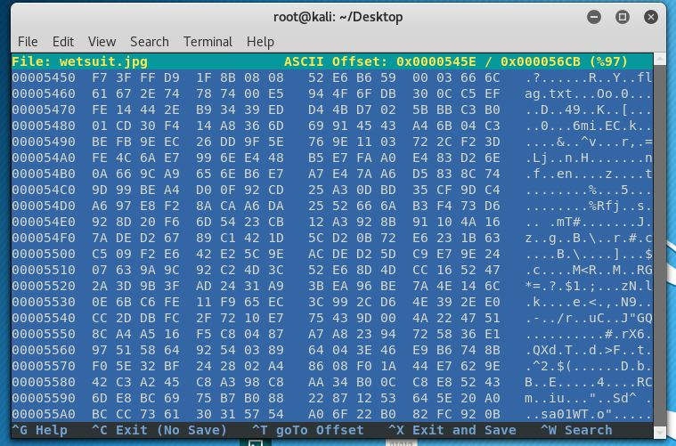

# Roscoe's Wetsuit
50 Points
>Nothing on the internet makes sense. It's all beneath me.
>author: @momopranto
## Solving it

We are given this image:


I belive its a meme of some sort but that does not matter. The first thing I tried when I got the image was opening it up in a [hex editor](https://en.wikipedia.org/wiki/Hex_editor) to look for anything interesting and I did find something.
To open it in the hex editor built into Kali Linux we type `# hexeditor wetsuit.jpg` and after poking around for a minute or two I see something interesting in the right pane:



Did you see it? It's very easy to miss but its there `flag.txt` That tells us that there is a file named flag.txt embeded in this image. To extract it we use a tool called `binwalk`:  https://github.com/devttys0/binwalk .  It was desinged to be used for reverse engineering firmware images but it can help us with this too.
I would highly recomend reading the [user manual](https://github.com/devttys0/binwalk/wiki/Usage) as it allowed me to figure out how to use binwalk in this particular instance.
The manual told me that I needed to use the `-e` flag to extract the image, so that's what I did with the folwoing command:
```
# binwalk -e wetsuit.jpg
```
That gives us a folder named `_wetsuit.jpg.extracted`. When we open up that folder we see two things:

```
flag.txt  flag.txt.gz
```
The only one we care about however is `flag.txt`.

To view it we type `# cat flag.txt` that shows us an excerpt from a story (which I have included in the repo for your reading pleasure) and the flag:
`flag{you_r_clapping_4_the_wrong_reasons}`

